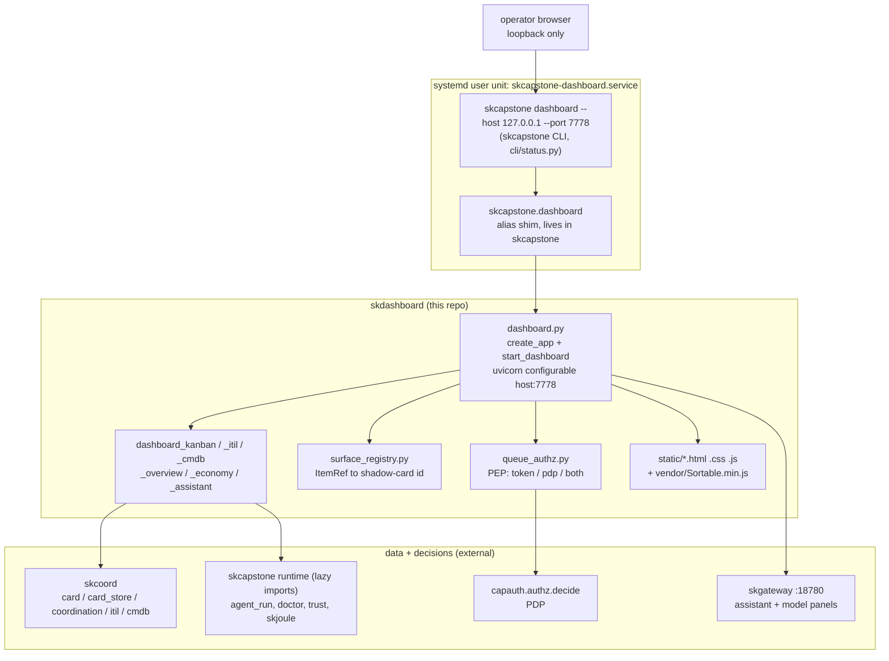

# skdashboard - Standard Operating Procedures

The SKWorld operator dashboard: a Starlette + uvicorn web UI and JSON API over the
coordination cluster (coord board, kanban, ITIL, CMDB, trust, economy, assistant).
Extracted from `skcapstone` (CR-4.3). It has no entry point of its own; the deployed
service is launched through the `skcapstone dashboard` CLI and binds `127.0.0.1:7778`.

## 1. Overview

**Kind:** service (a web UI plus JSON API), shipped as a **library** on PyPI.

**Owns:**

- The Starlette app factory and the whole `:7778` route table
  (`src/skdashboard/dashboard.py`, `create_app()` / `start_dashboard()`).
- The per-panel data modules: kanban board and event polling (`dashboard_kanban.py`),
  ITIL records (`dashboard_itil.py`), CMDB (`dashboard_cmdb.py`), overview
  (`dashboard_overview.py`), cost/joule economy (`dashboard_economy.py`), and the
  natural-language operator console (`dashboard_assistant.py`).
- The fleet **surface registry** (`surface_registry.py`): the pure mapping from an
  `(surface, item_id)` ItemRef to the shadow-card id the suggestion/queue machinery
  understands.
- The **authorization gate for privileged dashboard actions** (`queue_authz.py`): the
  staged `token` / `pdp` / `both` decision in front of queue-AI and the change.* PEPs.
- The SKWorld module manifest served at `/.well-known/skworld-module.json`
  (`skdashboard_manifest.py`).
- All front-end assets: 8 HTML pages, 6 CSS files, 9 JS modules, and one vendored
  `static/vendor/Sortable.min.js`, under `src/skdashboard/static/`.

**Explicitly does NOT do:**

- **It does not own a process.** `pyproject.toml` declares no `[project.scripts]`, so
  installing `skdashboard` puts no executable on `PATH`. See section 5.
- It does not own the coordination data. Cards, ITIL records, and the CMDB live in the
  skcoord/skcapstone coordination store; this repo reads and mutates them through
  `skcoord` (`skcoord.card`, `skcoord.card_store`, `skcoord.coordination`,
  `skcoord.itil`, `skcoord.cmdb`). There is exactly **one** exception, and CI greps to
  keep it at one: `consent.py` imports `skcapstone.card_store.CardStore` to append
  `consent.granted` events onto a card's own event log, reusing the store's existing
  append path rather than writing a parallel log. No other module may import
  `skcapstone.coordination` or `skcapstone.card_store`.
- It does not generate, sign, or store key material. `queue_authz.py` is a policy
  **enforcement point**; the decision comes from capauth's PDP. See `SECURITY.md`.
- It does not run inference. The assistant and model panels proxy skgateway
  (`SKGATEWAY_URL`, default `http://localhost:18780`).
- It does not terminate TLS or serve a public route. Loopback only, see section 5.

## 2. Architecture



### Start here

1. **`src/skdashboard/dashboard.py`**. The whole service.
   `DEFAULT_DASHBOARD_PORT = 7778`, `create_app(home)` builds the route list and every
   handler as a closure, `_capability_gate` is the one authorization body all write
   routes call, `_UvicornServer` binds the requested address, and
   `start_dashboard(home, host, port)`
   returns the server the caller drives with `serve_forever()`. Line numbers are
   deliberately not quoted here: they drift on every edit. Grep the symbol.
2. **`src/skdashboard/dashboard_kanban.py`**. Board state, card mutations
   (`apply_mutation`), the in-process event `BUS`, and `poll_event_store()`, which the
   Starlette lifespan runs as a background task feeding `/api/events` (SSE).
3. **`src/skdashboard/queue_authz.py`**. `authorize_capability()` and
   `authorize_queue()`: the fail-closed gate every privileged route calls, through the
   single `_capability_gate` helper in `dashboard.py`. Read this before changing
   anything that mutates state: every `POST` route in the service goes through it, and
   `tests/test_write_route_gates.py` fails the build if one stops.
4. **`src/skdashboard/surface_registry.py`**. Standard-library only, no skcapstone or
   skdashboard imports. `KNOWN_SURFACES`, `resolve_card_id()`, `parse_card_id()`.
5. **`src/skdashboard/skdashboard_manifest.py`**. The SKWorld module manifest (UI facet
   grade B + operator facet) served origin-relative so it cannot drift on host or port.

## 3. Build

Pure Python, no npm and no front-end build step. The static assets ship as package data
(`[tool.setuptools.package-data]`).

```bash
python -m pip install --upgrade build twine
python -m build
python -m twine check dist/*
```

The version is **not** written in `pyproject.toml`. It is derived by `setuptools_scm`
from the git tag, with `tag_regex` and `git_describe_command` both restricted to
`v<major>.<minor>.<patch>` so the fleet's non-semver tags (`swarm-20260717`,
`fixwave-20260723`, and similar) cannot poison the derived version. **Any build needs
full history and tags**: every `actions/checkout` in this repo sets `fetch-depth: 0`
and `fetch-tags: true` for exactly that reason. A shallow clone yields a placeholder
version and a broken wheel.

Local editable install into the fleet venv:

```bash
~/.skenv/bin/pip install -e .
```

## 4. Test

The green bar that blocks release is the `test` job in `.github/workflows/ci.yml`
(matrix: Python 3.10 and 3.12). It installs the real declared dependencies first, then
lays this checkout on top, then runs the suite:

```bash
pip install skcapstone starlette pytest
pip install --no-deps -e .
python -m pytest tests/ -q
```

Locally, against the fleet venv:

```bash
~/.skenv/bin/python -m pytest tests/ -q
```

Lint is also blocking (`lint` job): `ruff check src/ tests/`. The `build` job runs
`python -m build` plus `python -m twine check dist/*`. `secret-scan.yml` runs the
gitleaks **binary** (not the licensed action) over the full history with
`--exit-code 1`; this repo's history scanned clean on 2026-08-14, so a red scan means a
secret was **added**, and the fix is to rotate and purge it, never to weaken the gate.

There are 10 test modules. The heaviest are
`test_cm_p2_change_routes.py` (the change.* PEPs), `test_queue_gate_enforcement.py`,
`test_write_route_gates.py` (every `POST` route is gated, swept off the real route
table) and `test_queue_authz.py` (the authz gate, including its fail-closed paths), and
`test_surface_registry.py`. `test_smoke.py` deliberately does **not** import
`skdashboard.dashboard`; it asserts the package imports, is versioned, and ships its
modules and static assets.

Note the historical trap recorded in the CI file itself: the job once installed with
`--no-deps` only, so `dashboard_kanban`'s module-scope `skcoord` import and the queue
tests' `skcapstone` import failed at **collection**, and the kanban, ITIL and queue
tests were never actually running while the job showed as a test job. Do not
reintroduce a dependency-free install here.

## 5. Release / Deploy

### 2026-08-20 rollout record

The verified-human CAB change shipped through PR `#16`. The reviewed head passed
201 pytest cases, Ruff, JavaScript syntax checks, and GitGuardian before merge.
The rollout adds `POST /api/change/{id}/cab-vote`, operator-session verification,
schedule-window controls, and a separate deployment-arm action. Deploy from GitHub
with the editable install/restart procedure below; do not copy individual files to a
live checkout.

The same release line includes the read-only ATLAS Operator Cockpit at
`/api/operator/overview` and the cockpit page. It projects typed condition age,
freeze, the signed action lifecycle/change chain, cooldown/circuit state,
watchdog freshness, CMDB scope/completeness/audit, and SKBrain health/citations.
Missing or malformed evidence is `unknown`; an unreadable freeze record renders
frozen. The dashboard never authorizes or actuates from these projections.

### 2026-08-21 CMDB source and search validation

Card `3799733b` validated the three CMDB repositories against GitHub `main`, then
added the missing read-only search surface. The release gate is the complete
repository suite plus Ruff, build/twine, docs-check, and JavaScript syntax checks.
Deployment must use a GitHub pull followed by the editable install and
`skcapstone-dashboard.service` restart documented below; copying individual files
between nodes is not an accepted deployment path.

Card `e57ef91a` replaces the visible legacy seed action with explicit local
discovery plan/apply operations. The plan is read-only; apply uses the canonical
event-sourced reconciler and the existing capability gate. `/api/cmdb/seed`
remains a versioned compatibility alias and must not be used for a fleet
baseline. Whole-network apply continues through the governed SKCapstone/ATLAS
oneshot, not through the dashboard's local scope.

This repo has **two release surfaces, and only one of them is complete.**

### Library release (complete)

`.github/workflows/publish.yml` owns it. On a push to `main`, the `tag` job ranks every
`v*.*.*` tag with `sort -V`, takes the highest, and cuts the next patch tag (it never
uses `git describe`, because describe only sees ancestor tags and once restarted the
sequence at 0.0.1 below an existing 0.1.0). The `build` job refuses to publish a tag
that is not an ancestor of `origin/main` (override: repository variable
`ALLOW_OFF_MAIN_RELEASE=1`), and refuses any version containing `dev`, `+`, or `0.0.0`.
`pypi-publish` uploads via PyPI Trusted Publishing (OIDC, environment `pypi`), with no
token. Both `build` and `pypi-publish` carry `always() && !cancelled()` guards because a
skipped job propagates through the whole graph, not one level: a bare `needs:` there
once made a tagged release build cleanly and publish nothing.

**Do not push tags by hand.** The push to `main` cuts the tag.

Rollback for the library: yank on PyPI and pin consumers to the previous version. PyPI
has no delete API and the manage UI is authoritative.

### Process deploy (incomplete by design, today)

There is **no `skdashboard` systemd unit and no `skdashboard` console script.** The
running service is:

| Fact | Value |
|---|---|
| Unit | `skcapstone-dashboard.service` (systemd **user** unit) |
| Fragment | `~/.config/systemd/user/skcapstone-dashboard.service` |
| Drop-ins | `.d/cardstore.conf` (sets `SKCOORD_CARD_STORE=1`), `.d/restart-storm.conf` (Tier B backoff: `RestartSteps=8`, `RestartMaxDelaySec=5min`, `StartLimitIntervalSec=30min`, `StartLimitBurst=5`) |
| Effective ExecStart | `%h/.skenv/bin/skcapstone dashboard --port 7778` |
| Agent selection | `Environment=SKAGENT=lumina`, `SKCAPSTONE_AGENT=lumina` |

So the extraction is **complete at the packaging layer** (own repo, own
`pyproject.toml`, own CI, own publish workflow, own PyPI identity) and **incomplete at
the process layer**: `skcapstone dashboard` resolves `skcapstone.dashboard` to this
package through a transparent alias shim, and that shim lives in **skcapstone**
(`src/skcapstone/dashboard.py`: `import skdashboard.dashboard as _src; sys.modules[__name__] = _src`),
not in this repo. Consequence: **deploying a change to this package requires restarting
`skcapstone-dashboard.service`, and a `skcapstone` version that carries the shim.**

The repo owns the shutdown-policy drop-in at
`deploy/systemd/skcapstone-dashboard.service.d/shutdown.conf`. Uvicorn receives
`SIGINT`, its supported CLI shutdown signal, and at most 10 seconds to drain
active browser/streaming connections; systemd enforces `TimeoutStopSec=15s`.
Without all three controls, live restarts have remained in `stop-sigterm` until
systemd killed the process. Install the drop-in before restarting and verify the
journal reports a clean stop rather than a stop timeout or `SIGKILL`.

```bash
# deploy a change (fleet venv, editable checkout)
~/.skenv/bin/pip install -e .          # or: pip install -U skdashboard
systemctl --user restart skcapstone-dashboard.service
systemctl --user status  skcapstone-dashboard.service

# verify it is actually serving
curl -fsS http://127.0.0.1:7778/api/doctor | head

# rollback
~/.skenv/bin/pip install 'skdashboard==<previous>'
systemctl --user restart skcapstone-dashboard.service
```

### Front-end / Exposure

| Property | Value |
|---|---|
| Tier | Internal operator surface. Not public, not Funnel-exposed. |
| Bind address | **`127.0.0.1:7778` by default.** `skcapstone dashboard --host ADDRESS --port 7778` or `SKDASHBOARD_HOST=ADDRESS` deliberately selects another interface. |
| Public `:443` routes | **None.** There is no Cloudflare/Funnel/reverse-proxy route to this service. |
| Confirmed live | `ss -ltnp` shows `LISTEN 127.0.0.1:7778` owned by the process named `skcapstone`. |
| Health / self-report | `GET /api/doctor` (a JSON diagnostic report). There is **no `/health` route.** The module manifest advertises `GET /api/status` as its health URL. |

Reaching it from another machine remains an explicit operator decision. Prefer an SSH
tunnel or a tailnet address. `--host 0.0.0.0` exposes every interface and must only be
used with host firewall/tailnet controls and an armed authorization mode (section 6).
The safe default remains loopback because the bind is part of the access-control posture.

## 6. Configuration / Usage

**There is no skdashboard config file.** No YAML, TOML, JSON, or dotenv is read by this
package. Configuration is exactly two things: the `home` path passed to
`create_app(home)` / `start_dashboard(home, host, port)`, CLI bind options, and
environment variables.

```bash
# Safe default: local browser only.
skcapstone dashboard --port 7778

# Deliberate fleet exposure; prefer the node's tailnet address to all interfaces.
skcapstone dashboard --host 100.x.y.z --port 7778 --no-open
```

`home` is the skcapstone agent home. The CLI defaults it to skcapstone's `AGENT_HOME`
and exposes it as `--home`; the unit selects the agent with `SKAGENT` /
`SKCAPSTONE_AGENT` (`~/.skcapstone/agents/$SKAGENT/`).

| Variable | Read by | Default | Effect |
|---|---|---|---|
| `SKDASHBOARD_HOST` | `dashboard.py` (`start_dashboard`) | `127.0.0.1` | Server bind address when the caller does not pass an explicit `host`; an explicit argument wins. |
| `SKCAPSTONE_DAEMON_URL` | `dashboard.py` (`_daemon_base_url`) | unset | Full daemon HTTP origin used by server routes. An explicit CLI `daemon_port` wins; otherwise `SKCAPSTONE_DAEMON_PORT` and then port `7777` are fallbacks. |
| `SKCAPSTONE_DAEMON_PORT` | `dashboard.py` (`_daemon_base_url`) | `7777` | Loopback daemon port fallback when no full daemon URL or explicit argument is supplied. |
| `SKAI_AUTHZ` | `queue_authz.py` | `token` | Migration mode: `token`, `pdp`, or `both`. An unrecognized value silently falls back to `token` so a typo never widens or narrows access. |
| `SKAI_QUEUE_TOKEN` | `queue_authz.py` | unset | Shared secret compared with `hmac.compare_digest` in `token` mode. Unset in token mode = **deny**. |
| `SKGATEWAY_ADMIN_URL` | `dashboard.py` (`_gateway_admin_base_url`) | unset | Explicit skgateway management API origin for the `/api/models*` panel. |
| `SKGATEWAY_URL` | `dashboard.py` (`_gateway_admin_base_url`) | `http://localhost:18780/v1` | Inference origin used as the management fallback after removing only a trailing `/v1`. |
| `SKDASHBOARD_CM_WORKFLOW` | `dashboard.py` | `ci.yml` | Workflow filename the change Validate button nudges, since fleet repos do not all name it the same. |
| `SKCOORD_CARD_STORE` | skcoord (set by the unit drop-in) | unset | Event-sourced CardStore dual-write. Set to `1` in production by `cardstore.conf`. |
| `OLLAMA_HOST`, `ANTHROPIC_API_KEY`, `NVIDIA_API_KEY`, `XAI_API_KEY`, `MOONSHOT_API_KEY` | model panel | unset | Presence probes only, for the model availability panel. |

**Important default:** while **neither** `SKAI_AUTHZ` nor `SKAI_QUEUE_TOKEN` is set,
the privileged gate returns `{"ok": true, "reason": "loopback-open"}` (see
`_capability_gate` in `dashboard.py`, which `_queue_gate` and `_change_gate` both
wrap). That is the deployed state. The gate is a staging mechanism, not an active
control, until one of those two variables is set. Setting either one arms it for
**every** `POST` route at once, including the board mutations.

Usage:

```bash
skcapstone dashboard                    # 127.0.0.1:7778, opens a browser
skcapstone dashboard --port 9000        # different port, same loopback interface
skcapstone dashboard --no-open          # do not launch a browser (what the unit wants)
skcapstone dashboard --json             # print the daemon JSON snapshot and exit
```

## 7. API / Reference

Everything below is served on `127.0.0.1:7778`. Source of truth: the `routes = [`
list near the end of `create_app` in `src/skdashboard/dashboard.py`.

**Pages (HTML):** `/` and `/index.html` (overview), `/board`, `/cockpit`, `/models`,
`/assistant`, `/cmdb`, `/trust`, `/economy`. Static assets are mounted at `/static`
(only when the packaged `static/` directory is present).

**Read APIs (GET):**

| Route | Returns |
|---|---|
| `/api/status` | agent status across all pillars |
| `/api/doctor` | JSON diagnostic report (cached, `_DOCTOR_CACHE_TTL = 30.0`, because `run_diagnostics` rglobs the whole agent home and would block the event loop on every poll) |
| `/api/overview`, `/api/board`, `/api/kanban`, `/api/gtd`, `/api/memory`, `/api/daemon` | the panel payloads |
| `/api/card/{card_id}`, `/api/card/{card_id}/ai-suggestions` | one card, and its suggestions |
| `/api/events` | SSE stream fed by the `poll_event_store` lifespan task |
| `/api/itil/{overview,incidents,problems,changes}`, `/api/itil/kedb?q=`, `/api/itil/record/{kind}/{rid}` | ITIL |
| `/api/cmdb/overview`, `/api/cmdb/ci/{ci_id}` | CMDB overview and exact CI detail |
| `/api/cmdb/search?q=QUERY&limit=50` | Bounded read-only CMDB search; limit is clamped to 1-100 |
| `/api/cmdb/status`, `/api/cmdb/plan`, `/api/cmdb/drift` | Checksum-verified reconcile state, write-free local plan, and local drift |
| `/api/operator/overview` | Read-only ATLAS evidence, lifecycle, freeze, CMDB and SKBrain projection |
| `/api/trust/graph`, `/api/economy`, `/api/models` | trust graph, cost/joule ledger, model roster |
| `/api/suggest/{surface}/{id}` | suggestions for any fleet surface (`coord`, `gtd`, `itil`, `chat`, `security`) |
| `/api/change/{id}/pir-draft` | post-implementation-review draft |
| `/api/auth/capability` | hands the caller the `x-sk-actor` / `x-sk-capability` values to attach on mutating calls (`SKAI_OPERATOR_ACTOR` / `SKAI_QUEUE_TOKEN` verbatim). **Unauthenticated, loopback-trust only** - it does not verify who is asking, see `SECURITY.md`. |
| `/.well-known/skworld-module.json` | the SKWorld module manifest, unauthenticated public discovery metadata, no secrets |

**Mutating APIs (POST):** `/api/card/{card_id}/{action}`, `/api/card/{card_id}/queue-ai`,
`/api/queue/{surface}/{id}`, `/api/change/{id}/{cab-vote,validate,schedule,arm,verify}`,
`/api/cmdb/apply`, `/api/cmdb/seed` (compatibility), `/api/models/advertise`,
`/api/assistant`.

Every one of those POST routes passes through `_capability_gate`; the route-to-capability
map is the table in `SECURITY.md`, and `tests/test_write_route_gates.py` fails the build
if a POST route stops calling a gate.

**Headers the server reads:** `X-SK-Actor` (the actor identity, expected to be set by an
authenticating layer in front of the dashboard, and **not verified here**) and
`X-SK-Capability` (the capability token the gate checks). Read `SECURITY.md` before
relying on either: the gate is loopback-open by default, and the actor header is
self-asserted. `POST /api/change/{id}/cab-vote` additionally requires
`X-Operator-Token`; it is the only route here that currently rejects an unverified
human identity even while the general capability gate is loopback-open.

**Operator Cockpit change controls:** proposed or reviewing changes show verified CAB
Approve, Reject, and Abstain controls. Approved changes show ASAP, tonight 10 PM to
2 AM, tomorrow 10 PM to 2 AM, and editable local-time schedule options. Browser-local
times are converted to ISO timestamps before submission. Scheduled changes show a
separate arm action. The operator session token remains only in the password field and
is cleared after a successful vote; it is never written to browser storage.

Every shipped client (`api.js`, `assistant.js`, `ai_compose.js`, `cmdb.js`,
`models.html`) sources both headers from `GET /api/auth/capability` (coord card
`a638b490`) instead of hardcoding an actor. That route does not authenticate the
handout; see the new `SECURITY.md` section for exactly what trust boundary it does
and does not provide.

**Surface prefixes** (`surface_registry.py`): `gtd-`, `thr-` (chat), `sec-` (security);
`coord` and `itil` use the raw item id, because an ITIL id already carries its own
`inc-`/`prb-`/`chg-` prefix. `resolve_card_id()` is idempotent.

## 8. Troubleshooting

| Symptom | Check |
|---|---|
| Nothing on `:7778` | `systemctl --user status skcapstone-dashboard.service`, then `ss -ltnp \| grep 7778`. Remember the unit is named `skcapstone-dashboard`, **not** `skdashboard`. |
| `skdashboard: command not found` | Expected. There is no console script. Launch it with `skcapstone dashboard --port 7778`. |
| Unit dies instantly, or `203/EXEC` | `~/.skenv/bin/skcapstone` missing or not executable. `journalctl --user -u skcapstone-dashboard -n 50`. The restart-storm drop-in caps the retry loop, so a broken unit fails quietly rather than spinning. |
| Import error mentioning `skcapstone.dashboard` | The alias shim is missing from the installed `skcapstone` (it lives there, not here). Reinstall/upgrade `skcapstone`. |
| Code change deployed but the UI is unchanged | The process is long-lived. `systemctl --user restart skcapstone-dashboard.service`. An editable install alone changes nothing already imported. |
| Board is empty, or cards do not move | This repo only renders skcoord's store. Check the coordination store and `SKCOORD_CARD_STORE`; card status truth lives in `card_events/*.jsonl`, not `tasks/*.json`. |
| Queue-AI / change buttons return 403 | Someone set `SKAI_AUTHZ` or `SKAI_QUEUE_TOKEN`. The moment either is set the gate goes live: the browser now presents whatever `SKAI_QUEUE_TOKEN` / `SKAI_OPERATOR_ACTOR` this process is configured with (via `GET /api/auth/capability`), so a 403 usually means one of those two is unset, wrong, or `SKAI_OPERATOR_ACTOR` names a subject the PDP has no granted token for (`agentrun.queue`/`agentrun.execute`/`change.*`/`skgateway.admin` are separate grants - a subject can hold some and not others). Unset both authz vars to return to loopback-open, or configure a real, enrolled actor. |
| Human CAB action returns 401 | The CapAuth operator session token is missing, expired, revoked, or invalid. Mint or renew an approved device session and paste it into the CAB token field. `X-SK-Actor` cannot satisfy this route. |
| `/api/doctor` is stale | 30-second cache by design (`_DOCTOR_CACHE_TTL`). Wait it out. |
| `/api/models` returns 502 | skgateway is down or `SKGATEWAY_URL` is wrong (default `http://localhost:18780`, 3-second timeout). |
| Assistant or economy panel is empty but the page loads | Both lazy-import optional siblings (`skharness`, `skcapstone.skjoule`) and return a well-formed empty payload plus an `errors` note rather than a 500. Read the `errors` field. |
| CI `test` job red at collection | Something gained a module-scope import of a dependency the job does not install. Fix the install step, not the test. |
| Built wheel has a `.dev`/`+g<sha>` version | Shallow checkout. Every checkout needs `fetch-depth: 0` and `fetch-tags: true` or setuptools_scm cannot see the tag. |

## 9. Maturity-tier + Version reference

- **Maturity tier: `T0 - N/A (no key material)`.** skdashboard generates, signs, stores,
  and transports **no** key material. `queue_authz.py` compares a shared secret with
  `hmac.compare_digest` and delegates every real decision to `capauth.authz.decide`. It
  is a **non-crypto** repo under the SK Repo Doc Standard and carries no
  CRYPTOGRAPHY_STANDARD obligation of its own; that lives in
  [capauth](https://github.com/smilinTux/capauth).
- **Honest-claims note:** this repo makes **no** post-quantum claim of any kind, and
  uses none of the forbidden terms. Any PQ posture belongs to capauth and skcomms, not
  to a dashboard.
- **Version:** derived by `setuptools_scm` from the git tag. No SemVer number is written
  in `pyproject.toml`, and this SOP deliberately does not quote one, because it would be
  wrong on the next push to `main`. Report the truth with:
  `python -c "import importlib.metadata as m; print(m.version('skdashboard'))"`.
- **Known drift:** `src/skdashboard/__init__.py` hardcodes `__version__ = "0.1.0"`,
  which does **not** track the setuptools_scm distribution version. Trust
  `importlib.metadata.version("skdashboard")`; treat `skdashboard.__version__` as a
  presence marker only (that is all `test_smoke.py` asserts of it).
- **VERSION_LIFECYCLE phase:** Active. Only the latest published `0.x` line receives
  fixes.
- **License:** GPL-3.0-or-later. `LICENSE` is the verbatim GNU GPL v3 text and
  `pyproject.toml` declares `license = {text = "GPL-3.0-or-later"}`. These agree: GPLv3
  plus the "or later" option is the standard way to apply that text. Not relicensed
  here.
- **Standards:** `SK_REPO_DOC_STANDARD`, `DOCS_FRESHNESS_STANDARD`,
  `SECURITY_DISCLOSURE_STANDARD`, `SKWORLD_MODULE_CONTRACT_STANDARD` (the manifest in
  `skdashboard_manifest.py`), `SKWORLD_AUTHORIZATION_STANDARD` (the `queue_authz.py`
  PEP).

## Unverified / needs an operator pass

These are open questions, not statements of fact. Do not treat them as documented
behavior.

1. **Is a dedicated `skdashboard` console script planned?** Unknown. Today there is no
   `[project.scripts]` and no `skdashboard` unit, so the package cannot be run without
   `skcapstone`. Whether that is a deliberate end state or an unfinished step of CR-4.3
   is not recorded anywhere this audit could find. Until it is decided, section 5 stands
   as written and the "no console script" evidence check below pins the current reality.
2. **The alias shim is outside this repo's blast radius.** It was located at
   `skcapstone/src/skcapstone/dashboard.py` on the audited host, so the launch path is
   confirmed end to end. But it is a **skcapstone** file: no check in this repo can
   detect its removal, and no version constraint here pins it. The `skcapstone>=0.15.0`
   floor in `pyproject.toml` was not verified to be the version that introduced the
   shim.
3. **Whether any front-end asset is stale relative to the routes.** The 9 JS modules
   were not audited route by route against the current route table.
4. **The stale module docstring in `dashboard.py`** (lines 1 to 20) describes a stdlib
   `http.server` implementation and a short route list. The implementation is Starlette
   plus uvicorn with roughly 40 routes. This SOP documents the code, not that docstring.
   Fixing the docstring is a follow-up, deliberately not bundled into a docs-only PR.

<!-- docs-evidence
verified: 2026-08-21
checks:
  - name: CMDB search route and bounded implementation are present
    run: grep -q '"/api/cmdb/search"' src/skdashboard/dashboard.py && grep -q 'min(int(limit), 100)' src/skdashboard/dashboard_cmdb.py
  - name: card-mutate route is gated (section 7, SECURITY.md route table)
    run: grep -q 'capability=_CAP_CARD_MUTATE' src/skdashboard/dashboard.py
  - name: cmdb seed is a named gated handler, not the old ungated lambda
    run: ! grep -q 'Route("/api/cmdb/seed", lambda' src/skdashboard/dashboard.py
  - name: models advertise is gated on the documented skgateway.admin capability
    run: grep -q '_CAP_MODELS_ADVERTISE = "skgateway.admin"' src/skdashboard/dashboard.py
  - name: human CAB route requires the dedicated capability and verified operator
    run: grep -q 'capability="change.cab_vote"' src/skdashboard/dashboard.py && grep -q 'if not verified_actor.get("verified")' src/skdashboard/dashboard.py
  - name: exactly ONE gate body, short-circuiting only when BOTH authz vars are unset
    run: test "$(grep -c 'if not os.environ.get("SKAI_AUTHZ") and not os.environ.get("SKAI_QUEUE_TOKEN"):' src/skdashboard/dashboard.py)" = "1"
  - name: documented port 7778 still the module default
    run: grep -q 'DEFAULT_DASHBOARD_PORT = 7778' src/skdashboard/dashboard.py
  - name: bind remains loopback by default but accepts an explicit host
    run: grep -q 'DEFAULT_DASHBOARD_HOST = "127.0.0.1"' src/skdashboard/dashboard.py && grep -q 'bind_host = host or os.environ.get("SKDASHBOARD_HOST"' src/skdashboard/dashboard.py && grep -q '_UvicornServer(app, bind_host, port)' src/skdashboard/dashboard.py
  - name: /api/doctor is still a registered route
    run: grep -q 'Route("/api/doctor"' src/skdashboard/dashboard.py
  - name: still no /health route (SOP says there is none)
    run: ! grep -rq 'Route("/health"' src/skdashboard/
  - name: still no console script (launched via skcapstone dashboard)
    run: ! grep -q '^\[project.scripts\]' pyproject.toml
  - name: module entry point start_dashboard still exists
    run: grep -q '^def start_dashboard' src/skdashboard/dashboard.py
  - name: setuptools_scm still restricted to v-semver tags
    run: grep -q 'tag_regex = "\^v' pyproject.toml
  - name: dependency direction holds (consent.py is the ONLY skcapstone.card_store importer)
    run: test "$(grep -rlE --include='*.py' 'skcapstone\.(coordination|card_store)' src/skdashboard/ | sort | tr '\n' ' ')" = "src/skdashboard/consent.py "
-->
